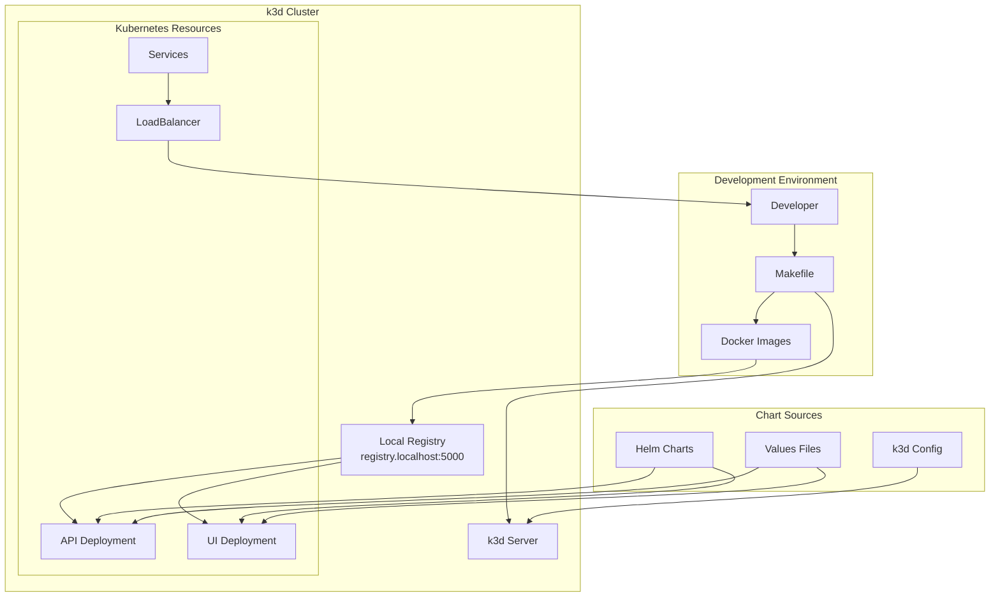

# Design Document

## Overview

This design implements a simple and practical Helm chart testing framework using k3d (k3s in Docker) for the video-to-podcast service, following the approach used in the go-mail-service repository. The solution provides automated validation of chart deployments using a lightweight Kubernetes cluster that runs in Docker containers.

The approach is straightforward and focuses on:
1. **k3d Cluster Management** - Create/destroy k3d clusters with local registry
2. **Image Building and Registry** - Build and push images to local registry
3. **Helm Chart Deployment** - Deploy charts with different configurations
4. **Basic Health Validation** - Verify services are running and accessible

## Architecture

### Core Components

#### 1. k3d Cluster Configuration
- **Purpose**: Defines the k3d cluster setup with local registry
- **Configuration File**: `k3d/video-podcast-cluster.yaml`
- **Features**:
  - Single server, single agent setup
  - Built-in local registry (registry.localhost:5000)
  - Port forwarding for LoadBalancer services
  - Lightweight and fast startup

#### 2. Makefile Targets
- **Purpose**: Provides simple commands for cluster management and testing
- **Key Targets**:
  - `start-k3d`: Create cluster and deploy application
  - `stop-k3d`: Destroy cluster and cleanup
  - `restart-k3d`: Full restart cycle
  - `push-to-registry`: Build and push images to local registry

#### 3. Local Registry Integration
- **Purpose**: Enables testing with locally built images
- **Registry**: `registry.localhost:5000`
- **Workflow**:
  - Build Docker images locally
  - Tag and push to local registry
  - Deploy Helm chart using local registry images

#### 4. LoadBalancer Service
- **Purpose**: Exposes services for external access during testing
- **Configuration**: `k3d/service.yaml`
- **Access**: Services accessible via localhost with port forwarding

### System Architecture Diagram



## Components and Interfaces

### 1. k3d Cluster Configuration

```yaml
# k3d/video-podcast-cluster.yaml
apiVersion: k3d.io/v1alpha5
kind: Simple
metadata:
  name: video-podcast-cluster
servers: 1
agents: 1
ports:
  - port: 80:80
    nodeFilters:
      - loadbalancer
  - port: 3000:3000
    nodeFilters:
      - loadbalancer
registries:
  create:
    name: registry.localhost
    host: "0.0.0.0"
    hostPort: "5000"
```

### 2. Makefile Interface

```makefile
# Key targets for k3d testing
.PHONY: start-cluster
start-cluster: ## create k3d cluster and deploy chart

.PHONY: push-to-registry  
push-to-registry: ## build and push images to local registry

.PHONY: start-k3d
start-k3d: start-cluster push-to-registry ## full k3d setup

.PHONY: stop-k3d
stop-k3d: ## destroy k3d cluster

.PHONY: restart-k3d
restart-k3d: stop-k3d start-k3d ## restart cluster

.PHONY: test-k3d
test-k3d: start-k3d test-endpoints ## deploy and test
```

### 3. LoadBalancer Service Configuration

```yaml
# k3d/service.yaml
apiVersion: v1
kind: Service
metadata:
  name: video-to-podcast-lb
spec:
  type: LoadBalancer
  selector:
    app.kubernetes.io/name: video-to-podcast
  ports:
    - name: api
      port: 8080
      targetPort: 8080
    - name: ui  
      port: 3000
      targetPort: 3000
```

## Data Models

### Cluster Configuration
The k3d cluster configuration defines:
- **Cluster Name**: `video-podcast-cluster`
- **Node Configuration**: 1 server + 1 agent
- **Registry**: Local registry at `registry.localhost:5000`
- **Port Mapping**: 80:80 and 3000:3000 for service access
- **Network**: Default k3d network with LoadBalancer support

### Image Management
- **API Image**: `registry.localhost:5000/video-to-podcast-api:latest`
- **UI Image**: `registry.localhost:5000/video-to-podcast-ui:latest`
- **Build Process**: Local Docker build → tag → push to registry
- **Deployment**: Helm chart pulls from local registry

## Error Handling

### Error Categories

1. **Cluster Creation Errors**
   - k3d installation missing
   - Docker daemon not running
   - Port conflicts (80, 3000, 5000)
   - Insufficient system resources

2. **Registry Errors**
   - Registry creation failures
   - Image push failures
   - Image pull failures in cluster
   - Registry connectivity issues

3. **Deployment Errors**
   - Helm chart template errors
   - Missing or invalid values
   - Resource creation failures
   - Pod startup failures

4. **Service Access Errors**
   - LoadBalancer not ready
   - Port forwarding issues
   - Service endpoint unavailable
   - Health check failures

### Error Handling Strategy

1. **Prerequisites Validation**
   - Check k3d installation
   - Verify Docker is running
   - Validate port availability
   - Confirm Helm installation

2. **Graceful Cleanup**
   - Always cleanup cluster on failure
   - Remove local registry
   - Clean up Docker resources
   - Clear temporary files

3. **Clear Error Messages**
   - Specific error descriptions
   - Suggested remediation steps
   - Links to documentation
   - Debug information collection

## Testing Strategy

### Test Workflow

#### Phase 1: Environment Setup
1. Validate prerequisites (k3d, Docker, Helm)
2. Check port availability (80, 3000, 5000)
3. Clean up any existing clusters
4. Create fresh k3d cluster with registry

#### Phase 2: Image Preparation
1. Build API Docker image
2. Build UI Docker image  
3. Tag images for local registry
4. Push images to registry.localhost:5000
5. Verify images are available in registry

#### Phase 3: Chart Deployment
1. Install Helm chart with test values
2. Wait for pods to be ready
3. Verify all resources are created
4. Check pod logs for errors
5. Apply LoadBalancer service

#### Phase 4: Service Validation
1. Wait for LoadBalancer to be ready
2. Test API health endpoint (http://localhost:8080/v1/health)
3. Test UI health endpoint (http://localhost:3000/health)
4. Verify inter-service communication
5. Test basic functionality

#### Phase 5: Configuration Testing
1. Test with default values
2. Test with development values
3. Test with production values
4. Validate configuration-specific behaviors
5. Test resource limits and requests

#### Phase 6: Cleanup
1. Collect test artifacts and logs
2. Destroy k3d cluster
3. Remove local registry
4. Clean up Docker resources
5. Generate test report

### Integration with CI/CD

```yaml
# .github/workflows/k3d-test.yml
name: k3d Helm Chart Tests
on: [push, pull_request]
jobs:
  k3d-test:
    runs-on: ubuntu-latest
    steps:
      - uses: actions/checkout@v4
      - name: Install k3d
        run: |
          curl -s https://raw.githubusercontent.com/k3d-io/k3d/main/install.sh | bash
      - name: Install Helm
        uses: azure/setup-helm@v3
      - name: Run k3d tests
        run: make test-k3d
      - name: Cleanup
        if: always()
        run: make stop-k3d
```

### Local Development Workflow

```bash
# Start development cluster
make start-k3d

# Make changes to code/charts
# ... edit files ...

# Rebuild and redeploy
make restart-k3d

# Test manually
curl http://localhost:8080/v1/health
curl http://localhost:3000/health

# Stop when done
make stop-k3d
```

### Test Validation Points

1. **Cluster Health**
   - All nodes are ready
   - System pods are running
   - Registry is accessible

2. **Image Availability**
   - Images pushed successfully
   - Images pullable from registry
   - Correct image tags used

3. **Chart Deployment**
   - All resources created
   - Pods reach ready state
   - Services have endpoints
   - ConfigMaps and Secrets applied

4. **Service Functionality**
   - Health endpoints respond
   - Services are accessible
   - Inter-service communication works
   - Basic API functionality works

5. **Resource Validation**
   - Resource limits respected
   - Persistent volumes mounted
   - Environment variables set
   - Security contexts applied