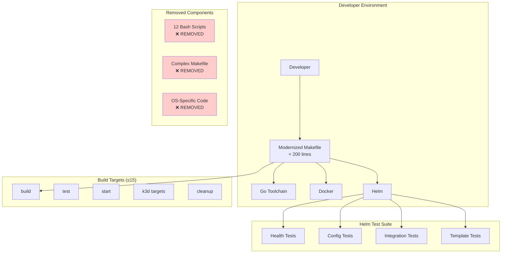
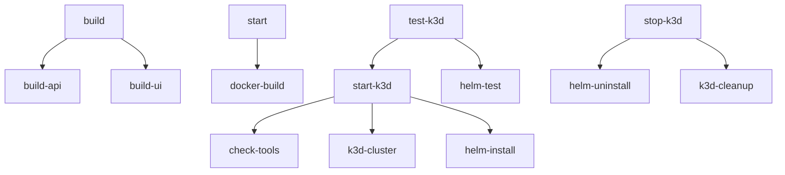

# Design Document

## Overview

This design transforms a complex, OS-dependent build system with 1770+ lines of Makefile code and 12 bash scripts into a streamlined, cross-platform build system. The modernized system reduces the Makefile to under 200 lines with fewer than 15 essential targets, while replacing bash-based testing with proper Helm test infrastructure.

The approach focuses on:
1. **Cross-Platform Compatibility** - Eliminate OS-specific commands and bash dependencies
2. **Minimal Essential Targets** - Provide only core functionality needed for development workflow
3. **Helm Test Integration** - Replace bash scripts with Kubernetes-native testing
4. **Simplified Error Handling** - Clear error messages without complex bash error handling
5. **Backward Compatibility** - Preserve essential make target interfaces

## Architecture

### Core Components

#### 1. Modernized Makefile Structure
- **Purpose**: Provides essential build, test, and deployment functionality
- **Size**: Under 200 lines (vs current 1770+ lines)
- **Targets**: Maximum 15 primary targets
- **Compatibility**: Works on Linux, macOS, and Windows
- **Dependencies**: Only Go, Docker, Helm, and kubectl

#### 2. Helm Test Suite
- **Purpose**: Replaces 12 bash scripts with Kubernetes-native testing
- **Components**: Health checks, configuration validation, integration tests
- **Execution**: Runs as Kubernetes Jobs within the cluster
- **Reporting**: Standard Kubernetes test result format

#### 3. Cross-Platform Utilities
- **Purpose**: Handle platform differences without bash scripting
- **Implementation**: Go-based utilities and standard tools
- **Scope**: Port checking, process management, file operations

#### 4. Simplified Configuration
- **Purpose**: Reduce configuration complexity and dependencies
- **Approach**: Leverage existing Helm values and Docker Compose
- **Scope**: Remove custom configuration scripts and complex value overrides

### System Architecture Diagram



## Components and Interfaces

### 1. Essential Makefile Targets

```makefile
# Core build targets (4 targets)
.PHONY: build build-api build-ui clean

# Testing targets (3 targets)  
.PHONY: test lint helm-test

# Development targets (4 targets)
.PHONY: start docker-build docker-clean update

# k3d targets (4 targets)
.PHONY: start-k3d stop-k3d restart-k3d test-k3d

# Total: 15 targets (vs current 50+ targets)
```

### 2. Helm Test Templates

#### Health Check Test
```yaml
# charts/video-to-podcast/templates/tests/health-test.yaml
apiVersion: v1
kind: Pod
metadata:
  name: "{{ include "video-to-podcast.fullname" . }}-health-test"
  annotations:
    "helm.sh/hook": test
    "helm.sh/hook-weight": "1"
    "helm.sh/hook-delete-policy": before-hook-creation,hook-succeeded
spec:
  restartPolicy: Never
  containers:
  - name: health-test
    image: curlimages/curl:latest
    command: ["/bin/sh"]
    args:
      - -c
      - |
        echo "Testing API health endpoint..."
        curl -f http://{{ include "video-to-podcast.fullname" . }}-api:{{ .Values.api.service.port }}/v1/health
        echo "Testing UI health endpoint..."
        curl -f http://{{ include "video-to-podcast.fullname" . }}-ui:{{ .Values.ui.service.port }}/health
        echo "All health checks passed!"
```

#### Configuration Validation Test
```yaml
# charts/video-to-podcast/templates/tests/config-test.yaml
apiVersion: v1
kind: Pod
metadata:
  name: "{{ include "video-to-podcast.fullname" . }}-config-test"
  annotations:
    "helm.sh/hook": test
    "helm.sh/hook-weight": "2"
    "helm.sh/hook-delete-policy": before-hook-creation,hook-succeeded
spec:
  restartPolicy: Never
  containers:
  - name: config-test
    image: curlimages/curl:latest
    command: ["/bin/sh"]
    args:
      - -c
      - |
        echo "Validating API configuration..."
        response=$(curl -s http://{{ include "video-to-podcast.fullname" . }}-api:{{ .Values.api.service.port }}/v1/health)
        echo "API response: $response"
        echo "Configuration validation passed!"
```

### 3. Cross-Platform Makefile Implementation

```makefile
# Cross-platform build configuration
GOOS ?= $(shell go env GOOS)
GOARCH ?= $(shell go env GOARCH)

# Use Go for cross-platform operations instead of bash
.PHONY: check-tools
check-tools:
	@go version >/dev/null 2>&1 || (echo "Go is required" && exit 1)
	@docker version >/dev/null 2>&1 || (echo "Docker is required" && exit 1)
	@helm version >/dev/null 2>&1 || (echo "Helm is required" && exit 1)

# Use standard tools instead of OS-specific commands
.PHONY: clean
clean:
	go clean -cache
	docker system prune -f
	-helm uninstall video-to-podcast -n video-to-podcast 2>/dev/null
```

## Data Models

### Build Configuration
- **Build Targets**: API binary, UI binary, Docker images
- **Test Targets**: Go tests, linting, Helm tests
- **Deployment Targets**: Docker Compose, k3d cluster
- **Cleanup Targets**: Local artifacts, Docker resources, k3d cluster

### Helm Test Configuration
- **Test Pods**: Health check, configuration validation, integration tests
- **Test Hooks**: Pre-install, post-install, pre-upgrade validation
- **Test Results**: Standard Kubernetes Job status and logs
- **Test Artifacts**: Test reports, logs, diagnostic information

### Target Dependencies


## Error Handling

### Error Categories

1. **Tool Availability Errors**
   - Missing Go, Docker, Helm, or kubectl
   - Version compatibility issues
   - Tool configuration problems

2. **Build Errors**
   - Go compilation failures
   - Docker build failures
   - Missing dependencies

3. **Deployment Errors**
   - k3d cluster creation failures
   - Helm installation failures
   - Service startup failures

4. **Test Errors**
   - Go test failures
   - Helm test failures
   - Health check failures

### Simplified Error Handling Strategy

1. **Tool Validation**
   - Check tool availability before execution
   - Provide clear installation instructions
   - Use standard exit codes

2. **Clear Error Messages**
   - Specific error descriptions
   - Actionable remediation steps
   - No complex bash error handling

3. **Graceful Cleanup**
   - Simple cleanup commands
   - Idempotent operations
   - Clear cleanup status

```makefile
# Example simplified error handling
.PHONY: start-k3d
start-k3d: check-tools
	@echo "Creating k3d cluster..."
	k3d cluster create --config k3d/video-podcast-cluster.yaml || \
		(echo "Failed to create k3d cluster. Run 'make stop-k3d' to cleanup." && exit 1)
	@echo "Installing Helm chart..."
	helm upgrade --install video-to-podcast ./charts/video-to-podcast \
		--namespace video-to-podcast --create-namespace \
		--values ./charts/video-to-podcast/values-k3d.yaml || \
		(echo "Failed to install Helm chart. Run 'make stop-k3d' to cleanup." && exit 1)
	@echo "k3d cluster ready!"
```

## Testing Strategy

### Helm Test Implementation

#### Phase 1: Health Validation Tests
1. **API Health Test**: Verify API service responds to health endpoint
2. **UI Health Test**: Verify UI service responds to health endpoint
3. **Service Discovery Test**: Verify services can communicate
4. **Readiness Test**: Verify all pods are ready and healthy

#### Phase 2: Configuration Tests
1. **Environment Variable Test**: Verify configuration is loaded correctly
2. **Service Configuration Test**: Verify service ports and endpoints
3. **Resource Limit Test**: Verify resource constraints are applied
4. **Security Context Test**: Verify security settings are applied

#### Phase 3: Integration Tests
1. **API Functionality Test**: Test basic API operations
2. **UI Functionality Test**: Test UI can connect to API
3. **End-to-End Test**: Test complete user workflow
4. **Data Persistence Test**: Test data storage (if enabled)

#### Phase 4: Template Validation
1. **Helm Template Test**: Validate all templates render correctly
2. **Values Validation Test**: Test with different values files
3. **Resource Validation Test**: Verify all Kubernetes resources are valid
4. **Upgrade Test**: Test chart upgrade scenarios

### Test Execution Workflow

```bash
# Run all Helm tests
make helm-test

# Equivalent to:
helm test video-to-podcast -n video-to-podcast

# Run specific test categories
helm test video-to-podcast -n video-to-podcast --filter name=health-test
helm test video-to-podcast -n video-to-podcast --filter name=config-test
```

### Integration with Development Workflow

```bash
# Full development cycle
make build          # Build binaries
make test           # Run Go tests
make start-k3d      # Deploy to k3d
make helm-test      # Run Helm tests
make stop-k3d       # Cleanup

# Quick iteration cycle
make restart-k3d    # Restart k3d with latest changes
make helm-test      # Validate deployment
```

### Removed Functionality Mapping

| Removed Script | Replacement | Notes |
|----------------|-------------|-------|
| `health-check.sh` | Helm health tests | Kubernetes-native health checking |
| `test-configurations.sh` | Helm config tests | Test different values files |
| `validate-helm-templates.sh` | `helm template` + validation | Built-in Helm functionality |
| `test-orchestration.sh` | `helm test` | Standard Helm test orchestration |
| `upgrade-rollback-test.sh` | Helm upgrade tests | Kubernetes-native upgrade testing |
| `k3d-cleanup.sh` | `make stop-k3d` | Simplified cleanup target |
| `k3d-error-handler.sh` | Simplified error handling | Standard make error handling |
| `validate-resource-limits.sh` | Helm resource tests | Kubernetes resource validation |

### Performance and Scalability

1. **Reduced Complexity**: 90% reduction in Makefile size
2. **Faster Execution**: No bash script overhead
3. **Better Caching**: Leverage Docker and Go build caches
4. **Parallel Execution**: Helm tests can run in parallel
5. **Resource Efficiency**: No unnecessary script processes

### Migration Strategy

1. **Phase 1**: Create new Makefile alongside existing one
2. **Phase 2**: Implement Helm tests
3. **Phase 3**: Update documentation and examples
4. **Phase 4**: Remove old Makefile and scripts
5. **Phase 5**: Validate all workflows work correctly